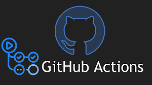

# CI/CDについて

2024/10/23

---
hideInToc: true
layout: image-left
image: layouts/images/sky.jpeg
---

# 目次

<Toc />

---

# 目的

- CI/CDに興味を持ってもらう
   - CI/CDなんとなく理解した！
   - なんかすごそう！
   - ちょっと触ってみようかな？

---
layout: center
hideInToc: true
---

# 自動化で「楽」しようぜ！！

---

# CI/CD ？

## 継続的インテグレーション（CI）

**ソースコードに変更をするたび**に自動でソフトウェアのビルドとテストを行う 
**ソフトウェア開発の手法**のこと

## 継続デリバリー（CD）

アプリケーションを**いつでもデプロイできる状態にする**こと 
（デプロイは通常、手動で行う必要がある）

---
hideInToc: true
---

## 継続デプロイメント (CD)

ソースコードのビルドからテスト、デプロイメントまでを**すべて自動**で行う

https://cloudbees.techmatrix.jp/devops/cd/

---
hideInToc: true
---

# CIの目的

[AWS | 継続的インテグレーションとは?](https://aws.amazon.com/jp/devops/continuous-integration/)

- バグを早期に発見して対処すること
- ソフトウェアの品質を高めること
- ソフトウェアの更新を検証してリリースするためにかかる時間を短縮すること

簡単にいうと

> 変更するたびに**自動でビルドとテスト**を行い、 
> **品質の高いソフトウェア**を担保する！

---
layout: center
---

じゃあどうやって実現するの？

---
layout: two-cols-header
---

# CI/CDのツール

::left::

- コード管理サービスが提供するサービス
   - GitHub Actions
   - GitLab CI/CD
   - Bitbucket Pipelines

- CI/CDのサービス(ソフトウェア)
   - Circle CI
   - Travis CI
   - Jenkins

::right::

---
layout: image
image: layouts/images/sky.jpeg
---

# まとめ

- 継続的インテグレーション（CI）
   - **変更のたび**に自動でビルドとテストを行う手法
- 継続デリバリー（CD）
   - アプリケーションを **いつでもデプロイできる**状態にすること
- CI/CDを整備することで、コードが変更するたびに **自動でビルドとテスト**を行い、 **品質の高いソフトウェア**を担保する！

---

# 次回(予定)

- GitHub Actionsについて
  - 実際にどうやって定義するのか

<!-- ---
layout: quote

# GitHub Actionsとは

> GitHub Actions は、  
> ビルド、テスト、デプロイのパイプラインを 
> 自動化できる 
> **継続的インテグレーション** と **継続的デリバリー**  (CI/CD)  
> のプラットフォームです。

[GitHub Docs | GitHub Actions を理解する](https://docs.github.com/ja/actions/about-github-actions/understanding-github-actions) -->
