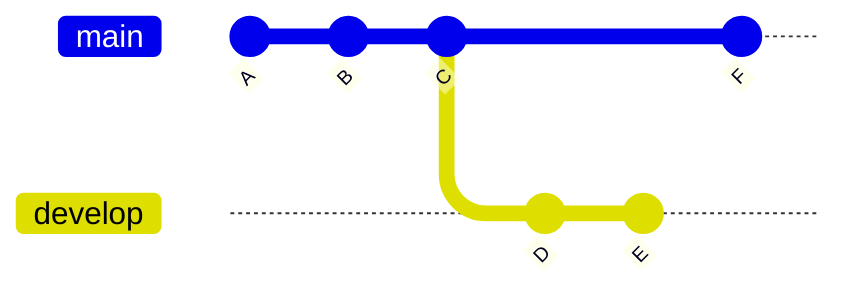
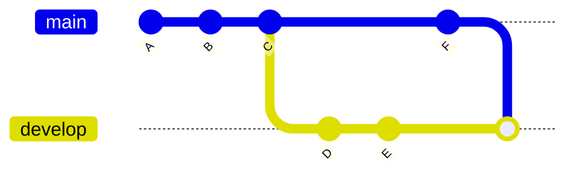
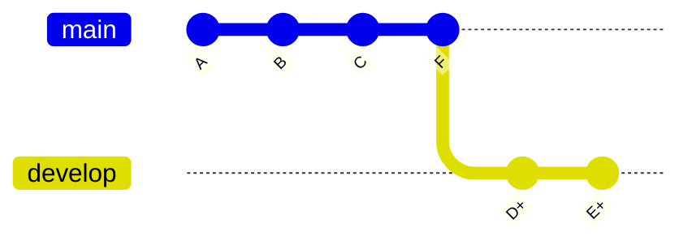

---
# You can also start simply with 'default'
theme: default
# random image from a curated Unsplash collection by Anthony
# like them? see https://unsplash.com/collections/94734566/slidev
background: layouts/images/sky.jpeg
# some information about your slides (markdown enabled)
title: Welcome to Slidev
info: |
  ## Slidev Starter Template
  Presentation slides for developers.

  Learn more at [Sli.dev](https://sli.dev)
# apply unocss classes to the current slide
class: text-center
# https://sli.dev/features/drawing
drawings:
  persist: false
# slide transition: https://sli.dev/guide/animations.html#slide-transitions
transition: fade-out
# enable MDC Syntax: https://sli.dev/features/mdc
mdc: true
# take snapshot for each slide in the overview
overviewSnapshots: true
fonts:
  # basically the text
  sans: M PLUS Rounded 1c
  # use with `font-serif` css class from UnoCSS
  serif: BIZ UDPMincho
  # for code blocks, inline code, etc.
  mono: M PLUS 1 Code
hideInToc: true
---

# rebaseについて

2024/10/16

---
hideInToc: true
layout: image-left
image: layouts/images/sky.jpeg
---

# 目次

<Toc />

---

# Q. 問題！

### Gitのブランチの変更を、
### 別ブランチに統合する方法は大きく2つあります！
### 何と何でしょうか！

#### ブランチ

---

# A. 答え！

## `merge` と `rebase` です！

`rebase`はと**あるブランチ**を**別のブランチ**に統合する方法の１つ

#### ブランチ

---

# ブランチ統合方法の違い

 

 

 

 

最終的な結果は同じで 
developにA〜Eまでが取り込まれた形になる

 

#### developにmainを取り込む

 

#### `merge`

 

 

 

#### `rebase`

 

---

# rebaseとは

gitのコマンドの１つで、[公式ドキュメント](https://git-scm.com/docs/git-rebase)では

> git-rebase - Reapply commits on top of another base tip
>
> (git-rebase - 別のベースチップの上にコミットを再適用する)

と記載がある。

言い換えると、`rebase`は「ブランチを切った地点」をずらすことで、ブランチに統合する方法の１つ

 

 

 

 

 

 

- developはmainの「C」からブランチを作成した
- rebaseすることでmainの最新コミットである「F」からブランチが作成されたように変更される

---

# rebaseでできること

`rebase`ではベースとして変更されたところから「コミットを作成し直す」

→ つまり、「**歴史改変**」ができるコマンド

→→ そのタイミングでコミットをあれこれしちゃおうぜ！ができる

### つまり

## 過去のコミットを「修正」するだけでなく、
## 「まとめ」たり「削除」したり、
## 「順番を入れ替え」たりできる！

---

# (紹介) 対話的なrebase

rebaseコマンドに`-i`オプション（`--interactive`）を付与する

#### 以下の操作ができる

- d, drop = commit削除
- x, exec = シェルを使用してコマンド実行
- f, fixup = 前のコミットにまとめる（コミットメッセージはまとめる先を使う）
- s, squash = 前のコミットにまとめる（コミットメッセージを入力する必要がある）
- e, edit = コミットを編集する
- r, reword = コミットメッセージのみ修正する
- p, pick = コミットを使用する（初期状態）

---

# rebaseの注意点

#### プッシュしたコミットをリベースしてはいけない

「歴史を書き換える」ため、push後にしてしまうと消える歴史が発生する可能性がある！ 
自分のみのブランチであれば問題はないが、他の人が関わるブランチでは基本的に❌

（PJによってはOKなところもあるっぽいので一概には言えませんが…。）

gitの[公式ドキュメント](https://git-scm.com/book/ja/v2/Git-%e3%81%ae%e3%83%96%e3%83%a9%e3%83%b3%e3%83%81%e6%a9%9f%e8%83%bd-%e3%83%aa%e3%83%99%e3%83%bc%e3%82%b9#r_pre_merge_rebase_work)では

> この指針に従っている限り、すべてはうまく進みます。 
> 
> もしこれを守らなければ、あなたは嫌われ者となり、友人や家族からも軽蔑されることになるでしょう。

と記載されています😭

---
layout: image-right
image: layouts/images/sky.jpeg
---

# まとめ

- `rebase`とは**あるブランチ**を**別のブランチ**に統合する方法の１つ
  - 言い換えると「ブランチを切った地点」をずらして統合する
- `rebase`は歴史改変コマンドの１つ
  - コミットを作り直す際にあれこれできる
    - コミットを削除したり…
    - コミットを編集したり…
    - コミットをまとめてみたり…
- `rebase`は注意して使おう
  - 無闇に使用するとリポジトリや他の人の作業を破壊する恐れがある