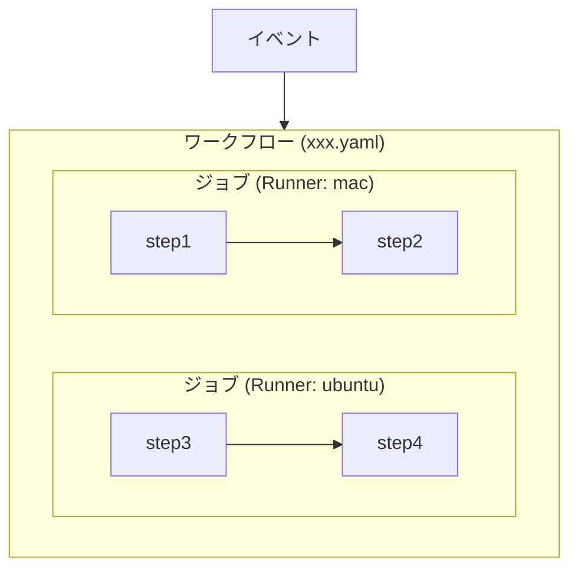
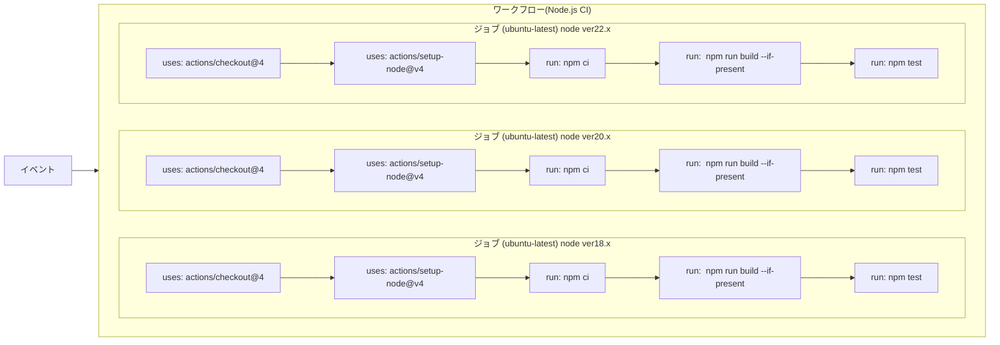

# GitHub Actionsについて

2024/10/29

---
hideInToc: true
layout: image-left
image: layouts/images/sky.jpeg
---

# 目次

<Toc />

---

<style>
p {
   opacity: 1 !important
}
h2 {
   --uno: 'text-blue';
}
strong {
   --uno: 'text-red';
   font-size: 1.2em;
   line-height: 1.5;
}
blockquote {
   p {
      --uno: 'text-size-2xl';
      line-height: 2rem;
   }
   strong {
      --uno: 'text-red text-3xl';
      line-height: 2;
   }
}
ul {
   font-size: 1.2em;
   li ul {
      font-size: 0.8em;
   }
}
</style>


# GitHub Actionsの知識(キーワード1/2)

<div class="flex">
<div class="basis-1/2 m-2 p-2">

- イベント
   - ワークフローを開始する条件
      - push, merge, schedule, dispatch
- ワークフロー
   - 1つ以上のジョブをまとめたもの
   - **1ファイル、1ワークフロー**
- ジョブ
   - 並列で実行される（依存が指定できる）
   - **ランナー**を指定できる
- ステップ
   - ジョブで実行される最小単位
   - **シェルスクリプト**か**アクション**

</div>
<div class="basis-1/2 m-2 p-2">



</div>
</div>

---

# GitHub Actionsの知識(キーワード2/2)

<div class="flex">
<div class="basis-1/2 m-2 p-2">

- アクション
   - **よく使用されるジョブ**をまとめたもの
      - キャッシュ
      - パッケージマネージャーの設定
      - gitのブランチ移動
      - アーティファクトの設定
   - [GitHub Marketplace](https://github.com/marketplace)にて探すことができる
- ランナー
   - ジョブが実行されるサーバー
   - Ubuntu、Windows、macOSから選択
   - セルフホストすることもできる
   - [ランナーのスペック一覧](https://docs.github.com/ja/actions/writing-workflows/choosing-where-your-workflow-runs/choosing-the-runner-for-a-job#%E3%83%91%E3%83%96%E3%83%AA%E3%83%83%E3%82%AF-%E3%83%AA%E3%83%9D%E3%82%B8%E3%83%88%E3%83%AA%E3%81%AE%E6%A8%99%E6%BA%96%E3%81%AE-github-%E3%81%A7%E3%83%9B%E3%82%B9%E3%83%88%E3%81%95%E3%82%8C%E3%81%9F%E3%83%A9%E3%83%B3%E3%83%8A%E3%83%BC)

</div>
<div class="basis-1/2 m-2 p-2">


</div>
</div>


---
layout: two-cols
---

<style>
ul {
   font-size: 0.7em;
   li ul {
      font-size: 0.8em;
   }
}
</style>

# 実際にどうやって書くの？

- `.github/workflows`ディレクトリを作成
- `yaml`ファイルを作成し設定を記載する

## 頑張ってかく

- [ワークフロー構文](https://docs.github.com/ja/actions/writing-workflows/workflow-syntax-for-github-actions)を見ながら頑張って書く

## テンプレートを使用する

- [starter-workflows](https://github.com/actions/starter-workflows/tree/main)リポジトリに例がたくさん！
- コピペして配置すればOK

::right::

```yaml
name: Node.js CI

on:
  push:
    branches: [ $default-branch ]
  pull_request:
    branches: [ $default-branch ]

jobs:
  build:
    runs-on: ubuntu-latest
    strategy:
      matrix:
        node-version: [18.x, 20.x, 22.x]

    steps:
    - uses: actions/checkout@v4
    - name: Use Node.js ${{ matrix.node-version }}
      uses: actions/setup-node@v4
      with:
        node-version: ${{ matrix.node-version }}
        cache: 'npm'
    - run: npm ci
    - run: npm run build --if-present
    - run: npm test
```

---
hideInToc: true
---

# P5のワークフローを表すとこんな感じ



---
layout: image
image: layouts/images/sky.jpeg
---

<style>
code {
   color: red;
}
</style>

# まとめ

- **ワークフロー**の中に**ジョブ**があり、ジョブの中に**ステップ**がある
- ジョブは**ランナー**が異なるため、**並列で動作**する
- ステップで実行できるのは、**シェルスクリプト**か**アクション**
- `.github/workflows`ディレクトリの中に`yaml`ファイルを作成して**配置するだけでOK！**
   - たくさんテンプレート転がってます！


<!-- ---
layout: quote

# GitHub Actionsとは

> GitHub Actions は、 <br>
> ビルド、テスト、デプロイのパイプラインを<br>
> 自動化できる<br>
> **継続的インテグレーション** と **継続的デリバリー**  (CI/CD) <br>
> のプラットフォームです。

[GitHub Docs | GitHub Actions を理解する](https://docs.github.com/ja/actions/about-github-actions/understanding-github-actions) -->
